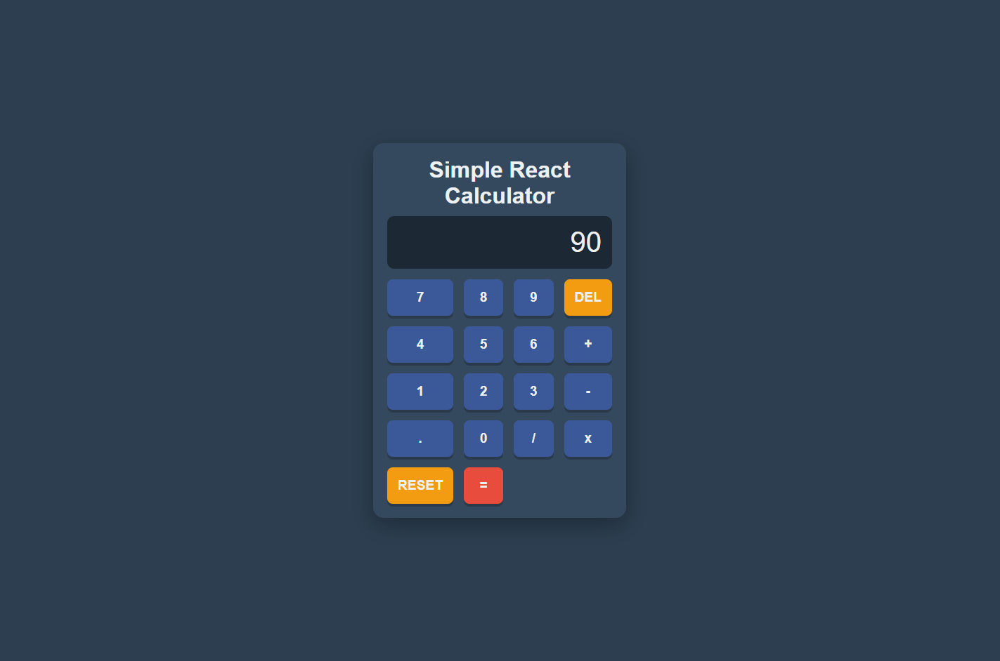

# Simple React Calculator



## Overview

This is a sleek and modern calculator application built with React. It features a user-friendly interface and supports basic arithmetic operations. The app is designed with a minimalist aesthetic, integrating React's robust component structure.

## Features

- **Basic Operations**: Supports addition, subtraction, multiplication, and division.
- **Responsive Design**: Works seamlessly on desktop and mobile devices.
- **Modern UI**: Clean and intuitive interface with React integration.

## Installation

Follow these steps to set up and run the app locally:

1. **Clone the repository**:

   ```bash
   git clone https://github.com/exagonsoft/react-calculator-app.git
   cd react-calculator-app
   ```

2. **Install dependencies**:

   ```bash
   npm install
   ```

3. **Start the App**

   ```bash
   npm start
   ```

## Usage

- Use the on-screen buttons or your keyboard to input numbers and operations.
- Click = to display the result.
- Press C to clear the display.

## Technologies Used

- React: Core library for building user interfaces.
- JavaScript (ES6+): Used for component logic and interaction.
- CSS: Styling for a modern and clean design.

## Project Structure

```text
react-calculator-app/
│
├── public/
│   └── index.html
│
├── src/
│   ├── components/
│   │   ├── Calculator.js
│   │   └── Button.js
│   │
│   ├── App.js
│   ├── index.js
│   └── styles.css
│
└── README.md
```


## Contributing

Feel free to fork the repository and make your own contributions. Pull requests are welcome!

## License

This project is licensed under the MIT License. See the LICENSE file for more information.

## Contact

If you have any questions or feedback, please contact exagonsoft@gmail.com.
